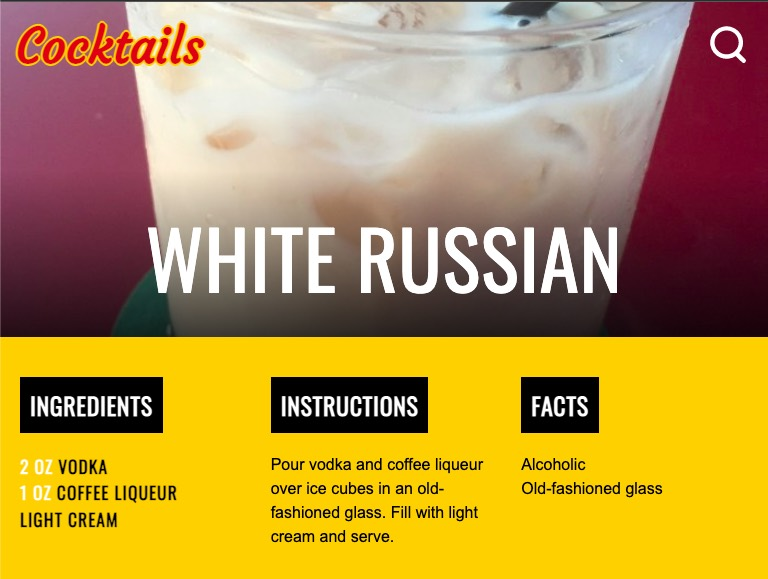
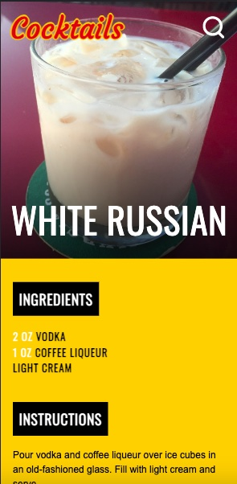

# cocktailDB

This is the [API module project](https://github.com/HackYourFuture/UsingAPIs/tree/main/Week3) for the HackYourFuture curriculum. cocktailDB is a single page application that interacts with TheCocktailDB public API and contains the following pages:

- Recipe page. Contains a drink image, short info, tags, ingredients, and instructions.
- Search page. When a user stops typing in the search form, a result list containing drinks appears below the search string. Clicking on a cocktail opens a recipe page.

Launching the app displays a random drink description as a homepage.

Design reference: <https://www.kahlua.com/en-us/drinks/>

## The project structure

```text
root
└── public
    └── assets
└── src
    └── api
    └── pages
    └── views
```

- `public` contains styles and static files
  - `assets` contains media files
- `src` contains JavaScript code
  - `pages` contains components of our app defining user interactions per page
  - `api` contains code to communicate with the web
  - `views` contains pure function components only used to render data into DOM elements
  - `app.js` contains the initialization code, simply starts the app

## The project features

1. When the page loads, the user is given a description of a random cocktail.
2. After the user stops writing a search query, the application reflects a page containing the search results by a drink name. Selecting an option generates a required drink page.
3. The app has error handling for the interaction with the API. In case of rejection user is given a status/error message.
4. The app is builded responsive.

|  Desktop            |  Mobile |
|---------------------|----------------------|
| |  |

## Install

To get started you can simply clone the repo and install the dependencies in the root folder:

```bash
# Clone this repository
$ git clone https://github.com/sergeyzoloto/cocktailDB.git

# Go into the repository
$ cd cocktailDB

# Install dependencies
$ npm install

# Run the app
$ npm start
```

Open [http://localhost:8080](http://localhost:8080) to view it in the browser.
